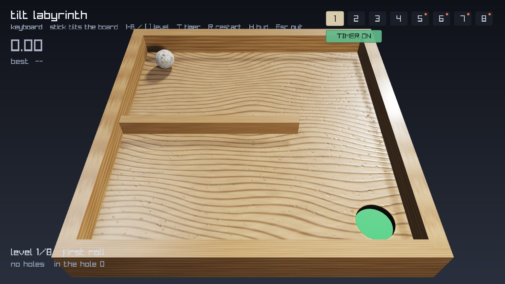
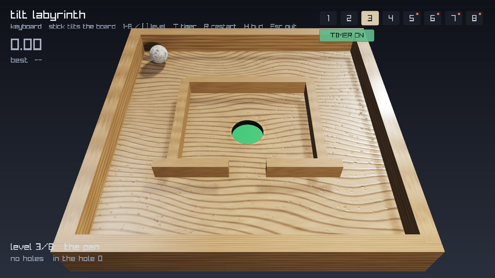
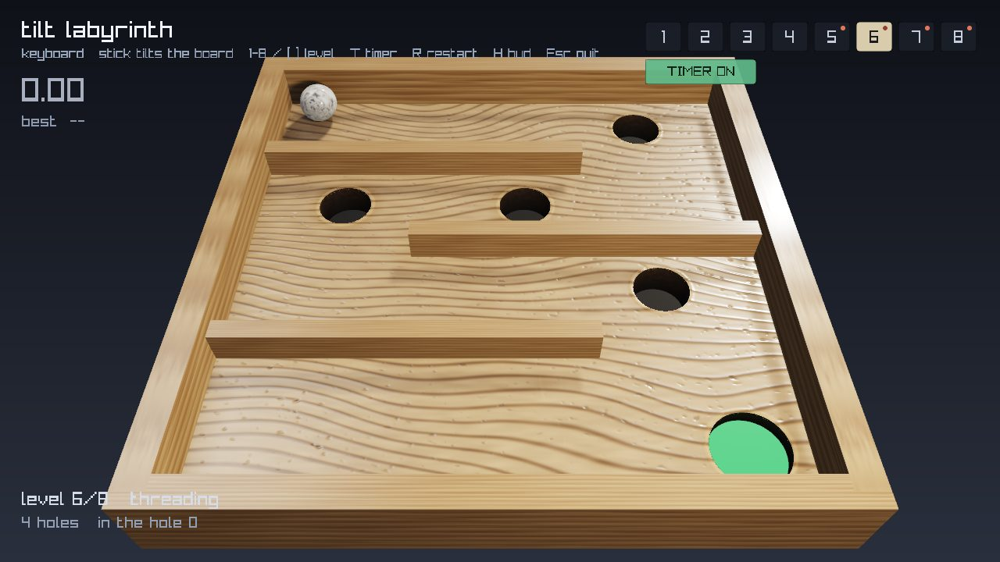
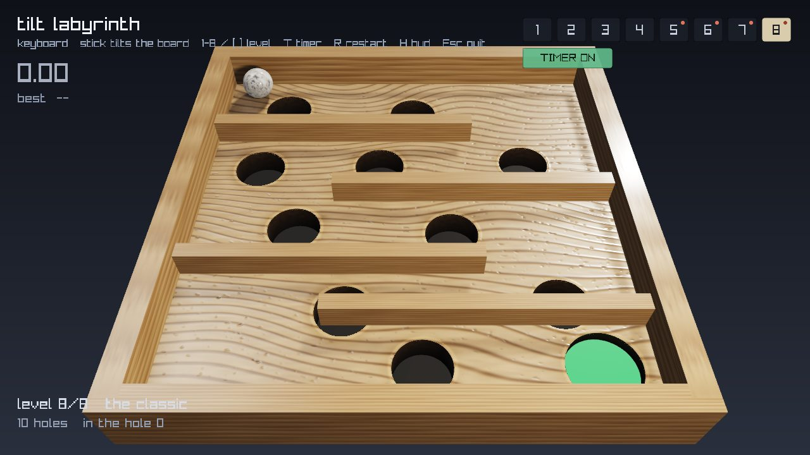

# Demo: tilt labyrinth

A test application for the joystick interface. The stick tilts a virtual board
and gravity moves a ball across it. The goal is to reach the green cup without
dropping into a hole.



```powershell
.\rnet.cmd demo labyrinth                          # fullscreen
.\rnet.cmd demo labyrinth --level 6 --timer        # start on 6, clock running
```

## Controls

| Key | Action |
|---|---|
| `1`–`8` | jump to a level |
| `[` `]` | previous / next level |
| `T` | timer on/off |
| `R` | restart the level |
| `H` | text HUD on/off |
| `F11` | fullscreen / windowed |
| `M` | next monitor |
| `Esc` | quit |

The level bar at top right is clickable, as is the timer toggle below it. A red
dot marks levels that contain holes. The level bar remains visible when `H`
hides the text HUD, since it is the navigation control.

Command-line flags: `--windowed`, `--no-hud`, `--deadzone`, `--expo`, `--port`,
`--monitor N`, `--fast-textures` (512 px maps, about 1.7 s faster to start), and
`--screenshot PATH --frames N` to render a PNG and exit.

The demo runs without the joystick attached, using arrow keys or WASD.
`--keyboard` forces keyboard input even when the rig is connected.

## Levels

Eight levels, defined in `tools/demos/levels.py`.



The first four contain no holes. Difficulty in those comes from geometry: a
single wall, a switchback, an enclosure entered through a gap, a staircase. The
reasoning is that metering a tilt is the primary skill, and resetting the player
before that skill is established gives no useful feedback.



Holes are introduced from level 5 onward, starting with two placed clear of the
direct route, and increasing in count and radius through level 8.



## Timer and best times

Off by default. Enable with `--timer` or the `T` key.

The clock starts on the first stick input rather than on level load, so the
level transition and an initial look at the board are not counted. Falling into
a hole resets the ball but not the clock.

Best times are stored per level in `tools/demos/scores.json`, keyed by level
name rather than index so that reordering or inserting levels does not reassign
existing records. Beating a record displays `NEW BEST` on the transition banner.

## Rendering

`tools/demos/pbr.py` implements a small physically based renderer: Cook-Torrance
GGX specular, normal mapping derived from screen-space derivatives (so mesh
tangents are not required), hemispheric ambient, ACES tonemapping and sRGB
handling.

**Procedural wood** (`texgen.py`, numpy and scipy). Growth rings come from a
warped radial coordinate with the centre placed off-canvas, producing the long
shallow arcs of flat-sawn stock rather than concentric rings. Ring spacing
varies across the board. Fibre is stretched along the grain, with sparse open
pores and ray fleck, the pale marks running across the grain. Roughness is
mottled rather than constant. No image assets are shipped; all maps are
generated at startup.

**Holes are cut, not painted.** Cutouts live in the albedo alpha channel and the
shader discards those fragments. Behind each is a hand-built tube mesh with
inward-facing normals, a chamfered lip, and a floor panel. A cylinder placed
under a solid plane renders as a flat black disc instead.

**Baked wall shadows and contact occlusion.** Walls do not move relative to the
board, so their shadows are computed once by shifting the wall footprint along
the light direction and blurring the result. For a planar receiver this is exact
rather than approximate, so no shadow map is needed. Only this layer is
recomputed on a level change; the wood beneath it is cached.

**Marble ball.** Turbulent-sine construction, where an fbm-displaced sine
field's zero crossings form the veins. The pattern is deliberately coarse
because the ball occupies roughly 55 px on screen. The material is dielectric
with a clearcoat and a wrapped diffuse term, so light carries past the
terminator. The ball rotates according to rolling velocity.

**Two lights.** A directional key light behind the board and lower than the
default, plus a positioned lamp on the camera side. See *Implementation notes*
below for why.

**Planar reflection.** The board is intersected against its own plane in the
fragment shader and sampled from its albedo, so the ball picks up a faint image
of the surface beneath it.

**Clearcoat.** A second, sharper specular lobe over the wood, giving a varnished
rather than raw appearance.

**Ball shadow.** Analytic ray-sphere soft shadow plus analytic sphere ambient
occlusion (both after Quilez). Occluding direct light alone is insufficient; the
ambient term has to be occluded as well or the ball does not appear to rest on
the surface.

**Physics.** The ball rolls rather than slides, so it accelerates at 5/7 g sin θ.
A solid sphere puts two sevenths of its energy into rotation.

## Implementation notes

Seven issues found during development, recorded because each is easy to
reintroduce.

1. **A near-overhead key light produces a shadow that is not visible.** At
   roughly 53° elevation the ball's shadow was short and fell directly behind
   the ball from the demo camera. Moving the key light behind the board and
   lowering it casts the shadow toward the viewer.
2. **With all lights behind the board, every camera-facing surface is
   unlit.** This is why the second light sits on the camera side.
3. **A directional light fixes a specular highlight to one point on a sphere**
   regardless of where the sphere moves. Only a positioned light produces a
   highlight that travels across the surface.
4. **Ambient occlusion applies to the ambient term; cast shadows apply to
   direct light.** Folding baked wall shadows into the occlusion channel made
   them invisible.
5. **`F0 + F * 0.5` on the ambient term is an energy gain**, which leaves a
   surface uniformly pale regardless of environment brightness. A
   roughness-aware Fresnel is required for the image-based lighting term.
6. **Hand-built meshes are easily wound backwards**, and a back-facing well
   floor is indistinguishable from a material bug. The wells therefore draw with
   backface culling disabled.
7. **Normal map strength is per texel**, so a scale factor that appears
   reasonable in isolation can turn a wood surface into bark.

The analytic environment predates the marble ball, when the ball was chrome. It
still drives reflections and the studio highlights, but matters less for a
dielectric surface. A mirror reflecting a smooth gradient reads as pearl rather
than metal; the fix was contrast between small bright sources and a dark
surround, which is why the highlight sources have hard edges.

## Requirements

```
python -m pip install pyserial raylib numpy scipy
```

---

[Back to the README](../README.md)
