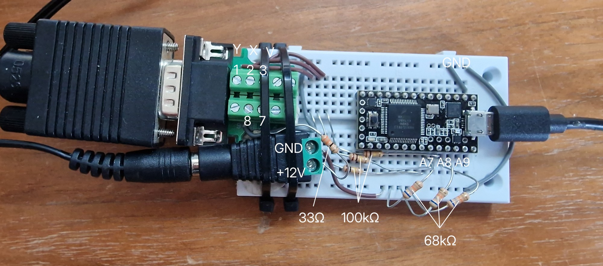

# Wiring the Teensy

Divider design for a 3.3 V ADC, the Teensy 3.0 pad map, expected readings, and the gotchas that cost the most time.



The build as wired. The D-sub breaks out to screw terminals — pins 1, 2 and 3
are Y, X and Vref; pins 7 and 8 are +12 V and ground. The 33 Ω sits in the
supply leg as a soft fuse, the 100 kΩ / 68 kΩ pairs divide each analogue output
down to something the 3.3 V ADC can read, and the taps land on A7, A8 and A9.

## Wiring (Teensy 3.0)

```
   joystick pin 7  ── [optional: 33 Ω] ── +12 V (bench supply)
   joystick pin 8  ──────────────────────  GND  (also tied to Teensy GND!)

   joystick pin 1 (Y) ──┬── 100 kΩ ──┬──► A7  (pad 21)
                        │            │
                        │           68 kΩ
                        │            │
                        │           GND

   joystick pin 2 (X) ──┬── 100 kΩ ──┬──► A8  (pad 22)
                        │            │
                        │           68 kΩ
                        │            │
                        │           GND

   joystick pin 3 (V) ──┬── 100 kΩ ──┬──► A9  (pad 23)
                        │            │
                        │           68 kΩ
                        │            │
                        │           GND

   3.5mm jack tip      ─────────────────► D2 (INPUT_PULLUP, pad 2)
   3.5mm jack sleeve   ─────────────────► GND
```

**Critical**: bench supply GND, joystick pin 8, and Teensy GND must all share a single node. Verify with DMM continuity before powering up.

### Teensy 3.0 board layout

Official pinout cards: <https://www.pjrc.com/teensy/pinout.html> (Teensy 3.0 is
`card5a` / `card5b`). Not redistributed here — download them alongside if you
want them locally.

Front side, component side up, USB at the left. `●` marks the pads this project uses:

```
   Vin  AGND  3.3V    23    22    21    20    19    18    17    16    15    14    13
    ○     ●     ○     ●     ●     ●     ○     ○     ○     ○     ○     ○     ○     ○
                     (A9)  (A8)  (A7)  (A6)  (A5)  (A4)  (A3)  (A2)  (A1)  (A0) (LED)
                    Vref     X     Y
  ┌───────────────────────────────────────────────────────────────────────────────┐
 USB                         T E E N S Y   3 . 0                           Reset ○
  │                            MK20DX128VLH5                              Program ○
  │                                                                           GND ○
  │                                                                          3.3V ○
  └───────────────────────────────────────────────────────────────────────────────┘
    ●     ○     ○     ●     ○     ○     ○     ○     ○     ○     ○     ○     ○     ○
   GND     0     1     2     3     4     5     6     7     8     9    10    11    12
```

Analog inputs are **not** separate pads — `A0`–`A9` are digital pads 14–23
(confirmed in the installed core, `cores/teensy3/pins_arduino.h:165`:
`analogInputToDigitalPin(p) = p + 14`). The silkscreen says `14`, the sketch says `A0`.

| Signal | Sketch pin | Teensy pad | Where |
|---|---|---|---|
| Y (joystick pin 1) via divider | `A7` | **21** | top row, 6th from left |
| X (joystick pin 2) via divider | `A8` | **22** | top row, 5th from left |
| Vref (joystick pin 3) via divider | `A9` | **23** | top row, 4th from left |
| MODE (joystick pin 6) | `D2` | **2** | bottom row, 4th from left |
| Divider bottom legs, joystick pin 8 | GND | **GND** or **AGND** | bottom-left / right edge, or top row 2nd from left |

A7/A8/A9 are three adjacent pads clustered at the **left end of the top row**.
Divider bottom legs currently return to the shared digital GND, which is correct —
AGND is tied to GND internally on Teensy 3.x, so the choice is a noise preference,
not a wiring requirement. Move them to AGND only if the readings turn out noisy.

Watch that the `3.3V` pad sits two positions left of pad 23 — don't bridge a divider
tap into it.

Alternate functions on these pads are all opt-in and unused here: touch sense on 22/23
(needs `touchRead()`), SPI chip-select, and `RX1` on pad 21 as an *alternate* Serial1
pin. Default Serial1 is pads 0/1 and this sketch uses USB serial, so nothing collides.

**Power warnings specific to this board:**

- **Vin accepts 3.7–5.5 V only.** Never connect the 12 V joystick supply to it.
  Power the Teensy from USB — you need the USB link for the serial monitor anyway.
  The two supplies stay separate and share only ground.
- **`3.3V` is an output, 100 mA max** — it powers your dividers' reference world, not the joystick.
- **Teensy 3.0 is not 5 V tolerant on any pin** (unlike 3.1/3.2, which tolerate 5 V on
  digital pins). This is why every joystick line needs a divider, and why joystick pin 6
  must be confirmed as a dry contact before it touches pad 2.
- **AREF is an inner pad on the back side**, not on the edge. Leave it alone; the sketch
  uses `analogReference(DEFAULT)` = the 3.3 V rail.

### Why 100k/68k (3.3 V target)

The divider does two jobs.

**1. Fit the swing under 3.3 V.** Teensy 3.0 is a 3.3 V part and its analog pins are *not* 5 V tolerant, so the joystick's 4.5–6.8 V output has to be scaled by roughly 0.4. 100k/68k gives 0.400: peak deflection lands at 2.72 V at the current ~11 V supply.

Headroom matters here because **Vref tracks about half the supply voltage**. Short the 33 Ω soft-fuse and the joystick sees a full 12 V, pushing Vref to ~6.1 V and peak deflection to ~7.35 V — still only 2.95 V at the ADC. A 100k/82k divider (ratio 0.446) gives ~7 % more resolution but hits 3.26 V under that same condition, right at the rail. Only use 82k if the supply stays pinned at 11 V.

**2. Keep the load high enough to stay symmetric.** The joystick has a 1.8 kΩ series resistor on X/Y but only ~470 Ω on Vref. That mismatch attenuates X/Y slightly more than Vref, biasing `dx = X − Vref`. At 170 kΩ total load the error is ~0.7 % (about 6 counts of static offset, which the sketch's startup calibration removes anyway). A 10k/6.8k version — same ratio, 17 kΩ load — would push it to ~7 %, well past what calibration should have to absorb. Tradeoff of the high-impedance approach: more noise-susceptible, so use short wires and a ground-plane breadboard.

### Voltage divider expected ADC values

With Teensy 3.0 (3.3 V reference, 10-bit `analogRead`), 100k/68k dividers, joystick running at ~11 V supply:
- **Vref (A2)**: ~700 counts (2.26 V at ADC) — should be rock steady.
- **X / Y at rest (A0, A1)**: ~695 counts, i.e. `dx0`/`dy0` calibrate out at about −6.
- **Full deflection**: `dx` or `dy` swings to **±143**.
- **Switch (D2)**: `0` open, `1` shorted.

Teensy 3.0 supports `analogReadResolution(12)` for 4× the resolution (Vref ≈ 2800, swing ≈ ±572) — one line in `setup()`, commented out in the sketch. The voltages don't change, only the scale.

## Field notes

- **High ADC source impedance is the gotcha on this build.** The 100k/68k dividers
  present ~40.5 kΩ, well above the ~10 kΩ the Teensy 3.0 sample-and-hold wants.
  Untreated, each conversion retains part of the *previous* channel's voltage, so
  deflecting the stick visibly drags the Vref reading and the axes look coupled.
  Fixed in firmware with `analogReadAveraging(32)` plus a discarded read per channel
  (`readSettled()`), which cut jitter from ±8 to ±4 counts and removed the
  correlation. A 100 nF cap from each tap to GND is the proper hardware cure if it
  ever resurfaces.
- **Symptoms seen during bring-up and what they meant:** all three channels pegged at
  1023 = dividers not dividing (tap on the wrong side of the 100 kΩ, or the 68 kΩ
  legs not reaching the shared ground node). All three reading ~2/3 of expected =
  joystick supply sagging, check for a brushed-together lead on the breadboard.
- **The PAB number `1822988` is the most specific identifier** for this exact unit. If pinout differs from documented norms in future testing, check Permobil's part registry for that PAB.
- The joystick is **fully functional and unmodified** as of last session — don't open the housing unless necessary for further investigation.
- Power supply was a bench unit set to 12 V with a 33 Ω series resistor in the +12V lead as a soft-fault limiter. The resistor is optional once the unit is verified non-faulty, but it does no harm.
- **NEVER** apply >12 V or reverse polarity. The joystick has internal regulation but the input stage limits are unknown.
- **NEVER** apply external voltage to pins 1, 2, or 3. These are joystick *outputs*. Only the Arduino's high-impedance ADC pin (via divider) should connect to them.
- The 1.8 kΩ series resistors inside the joystick on the X/Y outputs provide modest short-circuit protection on those pins, but Vref (470 Ω series in Bob's schematic, may be similar inside the real joystick) is less protected — don't short pin 3 to anything.

---

[← Back to the README](../README.md)
